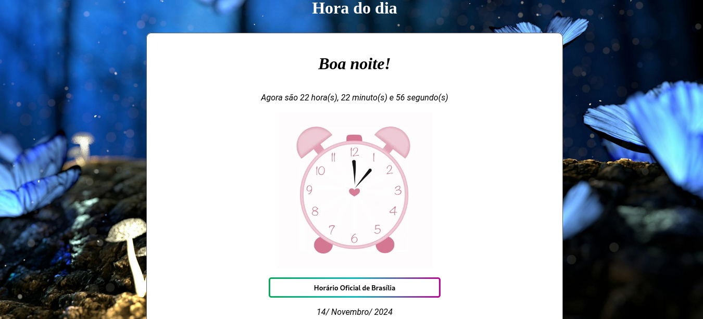

  <h1>Hora do Dia</h1>
    
    
    
     
     

Este projeto é um website simples que mostra o horário em tempo real e, de acordo com a hora do dia, altera o horário exibido, a cor de fundo e a imagem. Desenvolvido por <a target="_blank" rel="external" href="https://github.com/MegMinnie/"><strong>Mirele Oliveira da Silva</strong></a>
 

 

  ## Como Acessar a Aplicação

Acesse a aplicação por meio do link: <a href="https://megminnie.github.io/Hora-do-Dia/
"_blank">clique aqui</a>

## *Screenshots*

### Manhã

### Tarde

### Noite

